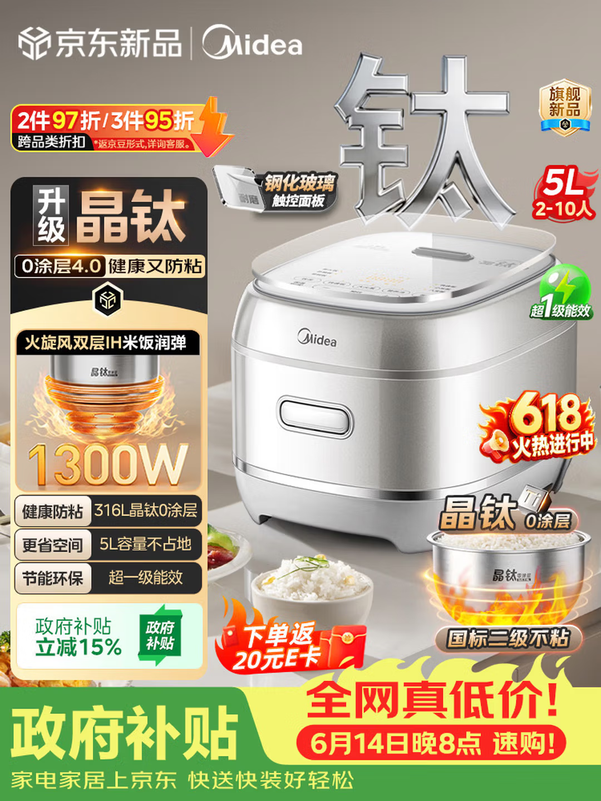

# 京东美的晶钛电饭煲强促销主图案例



> 图片文件建议保存到：`001-项目案例库/案例图片/京东美的晶钛电饭煲强促销主图.png`

---

## 基础信息

```text
案例名称：京东美的晶钛电饭煲强促销主图
图片类型：京东主图 / 活动主图 / 强促销主图
产品类目：电饭煲
品牌：Midea 美的
平台：京东
活动节点：京东新品 / 618 / 政府补贴
主图目标：同时建立新品信任、材质卖点、容量判断和活动转化
```

---

## 主图目标

这张图不是走高级极简路线，而是典型的京东家电强促销主图。

核心任务：

```text
品牌信任
+ 核心材质卖点
+ 大容量判断
+ 功率和能效证明
+ 政府补贴和 618 行动理由
```

用户看图后要快速得到三个判断：

- 这是京东新品和美的品牌产品，可信。
- 这是晶钛、0 涂层、5L 大容量电饭煲，卖点明确。
- 当前有政府补贴、E 卡返现和 618 活动，现在买更划算。

---

## 版式结构

版式属于：

```text
左文右图 + 底部强促销条 + 右侧产品证据贴片
```

区域分工：

| 区域 | 内容 | 作用 |
| --- | --- | --- |
| 顶部 | 京东新品 + Midea | 平台与品牌背书 |
| 左上 | 2件97折 / 3件95折 | 活动钩子 |
| 左侧 | 黑金卖点卡 | 集中讲清核心购买理由 |
| 右侧 | 电饭煲主体 | 建立真实产品感和商品信任 |
| 右上 | 金属大字“钛” | 强化晶钛核心卖点 |
| 右侧贴片 | 5L、超一级能效、618 | 快速补充判断 |
| 右下 | 晶钛内胆 + 米饭 + 火焰 | 材质和防粘证据 |
| 底部 | 政府补贴、返 E 卡、全网真低价 | 推动下单 |

---

## 核心卖点

主卖点：

```text
升级晶钛
0涂层4.0
健康又防粘
```

辅助卖点：

| 卖点 | 类型 | 表达方式 | 用户利益 |
| --- | --- | --- | --- |
| 5L 2-10人 | 容量卖点 | 红色容量徽章 | 适合大家庭和聚餐 |
| 1300W | 参数卖点 | 大数字 + 火焰特效 | 加热更猛，烹饪效率更高 |
| 火旋风双层 IH 米饭润弹 | 功能/结果卖点 | 内胆剖面 + 火焰光效 | 米饭口感更好 |
| 316L 晶钛 0 涂层 | 材质卖点 | 标签化表达 | 健康、防粘、安心 |
| 超一级能效 | 信任/省钱卖点 | 绿色能效标 | 节能、长期使用成本更低 |
| 政府补贴立减15% | 成交卖点 | 底部大色块 | 降低购买门槛 |

---

## 价格权益

这张图没有直接展示具体价格，而是用权益组合替代价格冲击。

权益组合：

```text
政府补贴立减15%
+ 下单返20元E卡
+ 全网真低价
+ 6月14日晚8点速购
+ 618火热进行中
```

可复用方法：

```text
当具体价格不确定或需要避免频繁改价时，可以用“补贴 + 返卡 + 大促节点 + 限时口号”组成价格权益区。
```

---

## 场景氛围

背景类型：

```text
浅灰米色家居台面 + 强促销贴片 + 金属材质特效
```

视觉元素：

- 金属大字“钛”
- 火焰加热光效
- 红色 618 标识
- 绿色政府补贴区
- 黄色全网低价条
- 内胆米饭实物证据

整体判断：

这张图促销感强、信息密度高，适合京东大促和补贴活动。它不适合直接作为高端日常主图，但适合作为“活动转化主图”的学习对象。

---

## 成功点

1. 核心卖点足够短，用户一眼能记住“晶钛”。
2. 左侧黑金信息卡把材质、功率、容量、能效集中解释，购买理由完整。
3. 右侧产品主体占比足够大，保留了商品真实感。
4. 底部用政府补贴和 618 节点制造购买理由，不依赖单一低价。
5. 内胆、米饭、火焰和参数共同组成了“材质 + 加热 + 口感”的证据链。

---

## 可优化点

- 右侧贴片较多，产品周围略显拥挤。
- 红、黄、绿、橙金同时出现，促销感很强，但品质感会被削弱。
- “晶钛”和“0涂层4.0”的技术解释不够具体，用户知道它强，但不一定知道为什么强。
- 底部促销条面积较大，容易压过产品主体。
- 右上金属“钛”字非常抢眼，使用时要注意不能遮挡产品关键结构。

---

## 可复用公式

```text
顶部品牌/平台背书
+
左侧黑金卖点卡
+
核心材质大字特效
+
右侧真实产品主体
+
容量/能效/活动徽章
+
内胆或局部证据贴片
+
底部政府补贴/返卡/大促成交条
```

适合复用到：

- 电饭煲
- 电压力锅
- 空气炸锅
- 微波炉
- 破壁机
- 电热水壶
- 其他有材质、功率、容量、能效和补贴权益的小家电

---

## 可复用提示词

```text
京东家电强促销主图，1:1正方形构图，顶部放京东新品和 Midea 品牌背书，左侧黑金卖点卡，突出“升级晶钛”“0涂层4.0”“健康又防粘”，左侧下方展示 1300W 大功率、316L 晶钛0涂层、5L容量、超一级能效等卖点标签。右侧放真实清晰的银色电饭煲产品主体，正面略俯视，产品占画面45%-50%，控制面板、品牌 Logo、机身材质清晰可见。产品后方有金属质感大字“钛”作为核心材质特效，不遮挡产品。右下角展示晶钛内胆、米饭和火焰加热光效，形成材质和防粘证据。底部做强促销成交区，包含政府补贴立减15%、下单返20元E卡、全网真低价、618活动节点。整体浅灰米色背景，红黄绿促销色点缀，信息密度高但层级清晰，京东爆款活动主图，高点击率，高转化。
```

---

## 同步沉淀建议

```text
003-产品结构排版库：补充“左文右图 + 底部政府补贴强促销条”
004-卖点表达库：补充“晶钛 / 0涂层 / 健康防粘 / 大功率加热”表达方式
005-价格与权益表达库：补充“政府补贴 + E卡返现 + 618速购”组合
006-AI关键词库：补充“晶钛电饭煲强促销主图”提示词方向
007-案例学习与卖点提取系统：可作为图片分析标准案例
```
