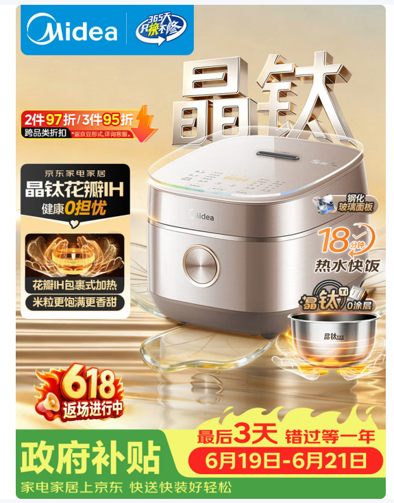

# 京东美的晶钛电饭煲搜索高吸引主图案例



---

## 基础信息

```text
案例名称：京东美的晶钛电饭煲搜索高吸引主图案例
图片类型：京东搜索列表主图 / 家电强促销主图 / 材质卖点主导案例
产品类目：电饭煲
品牌：Midea 美的
平台：京东
活动节点：618 / 返场活动 / 政策补贴
本次学习重点：不依赖底部权益腰带，分析画面本身为什么更吸引点击
```

---

## 核心判断

这张图的吸引力不只来自底部权益腰带。即使忽略底部政府补贴、日期和活动权益，它仍然比同屏普通主图更容易被注意到。

主要原因是：

```text
晶钛金属大字形成记忆点
+
大产品主体建立商品信任
+
左侧黑金卖点卡解释技术利益
+
右下角内胆证据补足材质信任
+
浅金背景和产品精修提升质感
```

这张图真正值得学习的是：把一个抽象材质卖点“晶钛”，做成了画面里的主视觉符号。

---

## 吸引力来源

### 1. “晶钛”大字把卖点变成视觉记忆

右上方金属立体“晶钛”是整张图最强的非产品视觉锚点。

它的价值不只是装饰，而是把核心技术卖点变成了用户能记住的图形资产：

- 字体足够大，搜索列表缩小后仍然能识别。
- 金属材质和“钛”这个词天然匹配，强化高级感和技术感。
- 大字放在产品后方，不直接遮挡电饭煲主体。
- “晶钛”比单纯写“0涂层”“IH加热”更有差异化记忆。

可复用方法：

```text
当产品有核心材质、核心技术或专属名称时，不要只放小标签。
可以把关键词做成背景大字，让卖点成为第一记忆点。
```

适合复用的词：

```text
晶钛 / 316L / IH / 0涂层 / 双胆 / 大火力 / 低糖 / 鲜活水 / 破壁
```

---

## 产品主体表现

产品主体位于画面右中区域，占比足够大，且没有被文字过度遮挡。

优秀点：

- 正面和顶部同时可见，能看清锅盖、控制面板、机身、旋钮。
- 产品 Logo 和旋钮保留清楚，增强真实商品感。
- 香槟金机身配合高光，呈现干净、健康、新品感。
- 产品边缘清晰，底部有柔和反光和接触阴影，不像生硬抠图。
- 主体完整，卖点贴片围绕产品分布，但没有压住关键结构。

这类电饭煲主图要避免把产品缩得太小。用户在搜索列表里先确认“这是什么、质感如何”，再决定是否读卖点。

---

## 左侧卖点卡

左侧黑金卖点卡是画面的第二信息中心。

结构为：

```text
京东家电家居背书
+
晶钛花瓣IH
+
健康0担忧
+
花瓣IH包裹式加热图
+
米粒更饱满更香甜
```

它的好处是把技术词转成了用户利益：

| 信息 | 作用 |
| --- | --- |
| 晶钛花瓣IH | 告诉用户核心技术是什么 |
| 健康0担忧 | 把材质卖点翻译成健康利益 |
| 包裹式加热图 | 用过程图解释为什么加热更好 |
| 米粒更饱满更香甜 | 给出用户能感知的结果 |

可复用方法：

```text
技术名称
+
用户利益
+
过程证据图
+
结果利益
```

这比单纯堆参数更适合搜索主图，因为用户能快速理解“这个功能对我有什么用”。

---

## 右侧辅助卖点与证据

右侧“18分钟热水快饭”是强数字化卖点。

优点：

- “18分钟”比“快速煮饭”更具体。
- 数字大，搜索列表里更容易被扫到。
- 和电饭煲品类的日常痛点直接相关：做饭慢、赶时间、下班回家想快吃。

右下角内胆是关键证据区。

主产品外观无法展示内胆材质，所以右下角单独放内胆，可以补足“晶钛0涂层”的视觉证据：

- 内胆和“晶钛0涂层”文字靠近，信息对应清楚。
- 火焰光效让内胆有功能感，不是普通配件图。
- 和左侧加热过程图形成呼应，建立“加热方式 + 内胆材质 + 米饭口感”的证据链。

---

## 背景和质感

背景是浅金色家居台面风，不是纯白，也不是深色重促销。

它的优势：

- 浅金背景和香槟金机身统一，整体更高级。
- 背景有光线和台面反射，但不会抢走产品。
- 金属大字、机身高光、台面反光处在同一套暖金光感里，画面不割裂。
- 比黑底促销图更温和，比白底商品图更有价值感。

这张图的质感不是靠复杂场景，而是靠：

```text
浅金背景
+
产品高光
+
金属大字
+
玻璃台面反射
+
内胆火焰光效
```

---

## 不看权益腰带时的视觉层级

```text
第一视觉：右侧大产品主体 + 背景金属“晶钛”大字
第二视觉：左侧黑金卖点卡
第三视觉：18分钟热水快饭 + 右下角内胆证据
第四视觉：顶部 Midea 品牌背书与只换不修标识
```

信息动线：

```text
品牌信任
→ 晶钛大卖点
→ 产品真实质感
→ 左侧技术解释
→ 右侧速度卖点
→ 内胆材质证据
```

---

## 可复用公式

```text
顶部品牌背书
+
核心材质/技术背景大字
+
右侧大产品主体
+
左侧黑金卖点卡
+
过程图解释技术
+
数字化效率卖点
+
右下角局部证据图
+
浅金棚拍质感背景
```

适合复用到：

- 电饭煲
- 电压力锅
- 电炖锅
- 空气炸锅
- 破壁机
- 电水壶
- 其他有材质、加热、健康、速度卖点的厨房小家电

---

## 复用注意

- 不要只复制“晶钛”大字，要先确认产品是否有足够强的核心技术词。
- 金属大字不能遮挡产品关键结构，最好作为产品后方背景层。
- 左侧卖点卡不要堆太多参数，要保留“技术、利益、证据、结果”的逻辑。
- 内胆、配件、局部证据必须和主卖点强相关，否则会变成干扰贴片。
- 浅金背景适合健康、材质、高级感产品；如果是低价爆款，可能需要更强的红橙促销色辅助。

---

## 沉淀结论

这张图比普通搜索主图更吸引人的根本原因是：

```text
它不是只靠促销权益抢眼，
而是把“晶钛”这个核心材质卖点做成了可记忆的视觉中心，
再用大产品、卖点卡、内胆证据和浅金质感完成信任闭环。
```

后续做家电主图时，可以优先学习它的“核心技术视觉化”方法。
